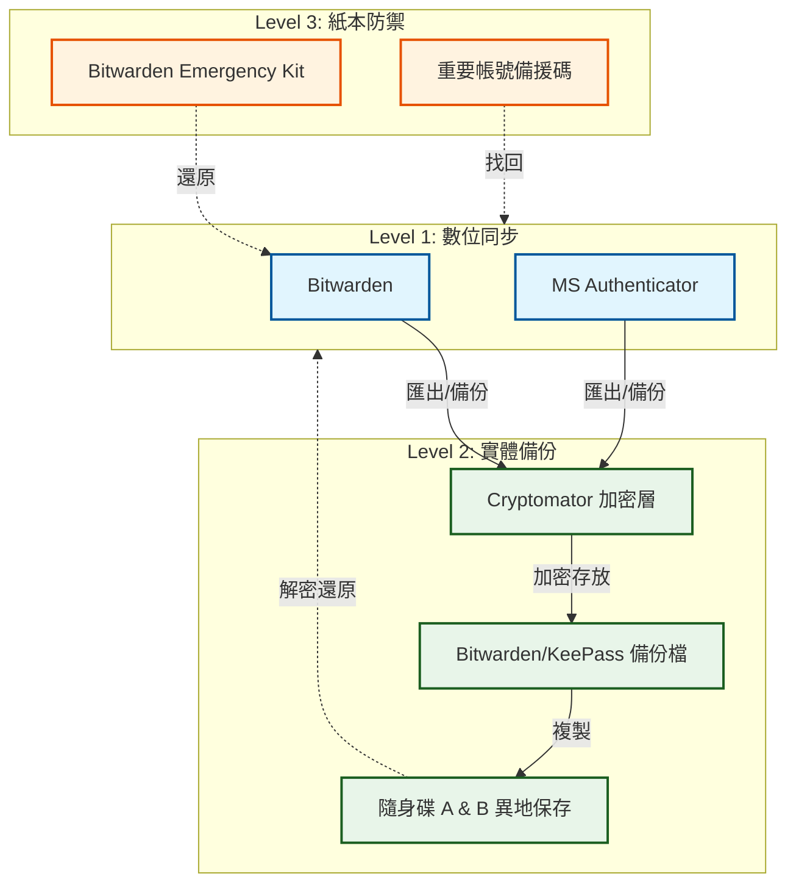

## *⭐ 個人機密 - 資安防護措施 ⭐*
> #### *這是一份個人災難復原 (DR) 規劃範本。它展示了如何透過數位加密與紙本備份，實踐 3-2-1 備份原則（ 三份資料、兩種媒介、一份異地 ） 來保障個人帳號安全。請注意：此處所有路徑與資料皆為示意，嚴禁填入真實機密資料。*

<br>



<br>

### *⭐ 存放設計*
```
•　Level 1.　數位同步
   - Bitwarden (95% of the Password)
     ➔ 該 Master Password 必須自行記住 (整體的主入口)
   - Microsoft Authenticator (2FA)
     ➔ 設定同時且須備份至 KeePassXC.kdbx
   - 須額外獨立 2FA (Google Authenticator)
     ➔ Bitwarden
     ➔ Microsoft

•　Level 2.　實體備份
   - 異地保存中的硬碟/USB 存有加密後的 ...
     ➔ Bitwarden 備份檔
     ➔ KeePassXC.kdbx

•　Level 3.　紙本防禦
   - Bitwarden Emergency Kit 
     ➔ 含 Master Password
   - Recovery Codes
     ➔ 重要帳號的手寫紙本
     

⭐ 核心帳號
•　可能的核心: Google / Microsoft / Bitwarden
•　用 Cryptomator 加密檔案夾才放入隨身碟
   - 密碼用記得起來的嚴謹密碼
   - 隨身碟 * 2 (雞蛋別放同個藍)
•　備援碼存放加密後的 ...
   - 隨身碟
   - ⭐ 物理安全存放區 A/B
•　密碼存放加密後的 ...
   - 隨身碟
```

<br>

### *⭐ 可能情境*

#### *# 1　手機遺失 ( 常見情境 )*
```
•　現狀： Bitwarden 需要 2FA 驗證碼才能登入
•　風險： 如果沒有手機，也沒記住 Master Password，就進不去
•　解法：
   - 緊急存取代碼 (Emergency Kit)： Bitwarden 官方提供的 PDF，
     上面有 Master Password 和 Recovery Key。
     請將此 PDF 列印出來，存放在實體保險箱或信任的人手中。
     只要有這張紙，即便手機、電腦全毀，都能在任何一台新裝置上救回所有帳號。
     
   - 備用冷儲存 : USB (含異地)
   - 備用冷儲存 : 紙本 (含異地)
```

#### *# 2　手機、電腦全毀*
```
•　現狀： 完全無法觸及原本的數位裝置
•　解法：
   - 冷儲存 (Cold Storage)： 冷儲存應該包含一個加密後的資料庫備份
    （存有 KeePassXC 的 .kdbx 檔案或 Bitwarden 的匯出檔）。
    
   - 必要條件： 冷儲存裝置（USB 隨身碟）絕對不能只放在家裡。
     如果有地震、火災，家裡一切就全沒。建議存放於異地
    （例如放在物理安全存放區 A/B）。
     
   - 恢復機制： 只要找得到任何一台能連網的電腦，插入冷儲存裝置，
     解密後即可救回所有資訊。
```

#### *# 3　手機、電腦、冷儲存全滅*
```
•　現狀： 最悲觀的情況，物理資產全部消失
•　解法：
  - 帳號找回的最後底牌 (Account Recovery Codes)：
    針對最重要的幾個「根帳號」（如電子郵件主信箱、GitHub、AWS/Azure 雲端帳號），
    必須擁有它們在設定 2FA 時產生的 「備援碼 (Recovery Codes)」。
    
  - 執行細節： 代碼應該手抄在紙本筆記本上，並放在一個 「非數位化」的地方
   （例如放在物理安全存放區 A/B）。
  
  - 結論： 只要能救回「郵件信箱」核心帳號，其他的帳號理論上都能
    透過「忘記密碼」流程發送驗證碼到信箱來重新奪回控制權。
```

<br>

### *⭐ 驗證檢核清單*
| *項目* | *檢查動作* |
|:--|:--|
| *口　紙本正確性* | *確認筆記本上的密碼與備援碼是否為最新版本* |
| *口　隨身碟健康度* | *讀取一次 .kdbx 或 Cryptomator 檔案，確保沒有損壞* |
| *口　Emergency Kit* | *檢查列印出的 PDF 是否依然清晰可辨* |
| *口　2FA 備份* | *如果新增重要帳號，確認是否有同步更新至離線保險庫* |

<br><br>