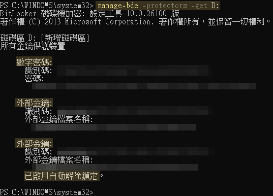
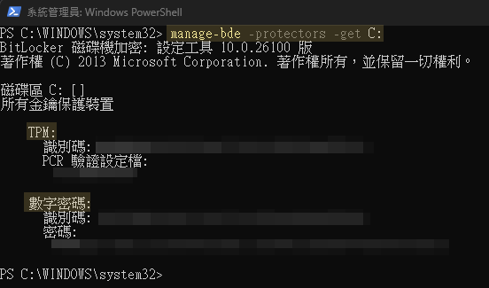

## *⭐ BitLocker ⭐*
> #### *系統管理員權限執行*

> #### *預設 3 個硬碟 C/D/E ; 密鑰放在 E 槽 ( 暫時 ➔ 存放安全位置 )*

<br>

### *A.　⭐ 操作步驟*
> #### *TPM & 恢復密鑰 ➔ 彼此獨立*
```powershell
[1] 確認 TPM 是否為就緒: 強烈依賴電腦硬體的 TPM ( BIOS 設定 )
tpm.msc

[2] 執行加密腳本: C + D 槽加密 
./scripts/bit_locker.ps1

    # 若是遇到解析問題 另存新檔為 BOM-UTF8 格式
    ./scripts/fix_encoding.ps1

[3] 重新開機 ➔ 重開機進入桌面 ➔ C 碟正式轉為加密中（ 保護開啟 ）

[4] 執行該指令 ➔ D 碟的自動解鎖就會成功啟用，以後開機進入就不需要手動輸入 D 碟密碼
    # 1. 檢視 D 碟的加密狀態與保護裝置
    manage-bde -protectors -get D:
    
    # 2. 解鎖資料碟
    manage-bde -unlock D: -RecoveryPassword "48位元修復金鑰"
    
    # 3. 確保自動解鎖已啟用
    Enable-BitLockerAutoUnlock -MountPoint "D:"

[5] 查看加密進度
manage-bde -status
```



<br>

### *B.　其他*
```powershell
# 加密需要時間
  - 腳本執行完畢只代表 ➔ 開始加密程序
  - 加密過程可直接切換使用者或重啟電腦是安全的，Windows 會在背景默默把剩下的部分加密完

# 清除 C 碟所有數字密碼保護器
manage-bde -protectors -delete C: -type RecoveryPassword

# 手動刪除其他識別碼
manage-bde -protectors -delete C: -id "{刪除舊識別碼}"

# 已加密完成的碟 密鑰即不在異動 唯一所在即密鑰區 (務必妥善保管)
```

<br>

### *C.　確認加密有效性*
```
# 資料碟 (重置法)
    1. 關閉自動解鎖
    Disable-BitLockerAutoUnlock -MountPoint "D:"
    
    2. 新增新的密碼保護器 (當下能掌控的唯一密鑰)
    manage-bde -protectors -add D: -RecoveryPassword
    
    3. 刪除舊的密碼保護器 (移除不確定的所有密鑰 # 不含剛新增的)
    manage-bde -protectors -get D:
    manage-bde -protectors -delete D: -ID "{刪除舊識別碼}"
    
    4. 重新啟用自動解鎖 (它會自動將 TPM 綁定重新建立)
    Enable-BitLockerAutoUnlock -MountPoint "D:"

# 系統碟
    - [驗證程序] 
        檢視 C 碟目前的修復金鑰
        manage-bde -protectors -get C:
        
        強制 C 碟在下次重啟時進入 BitLocker 復原模式
        manage-bde -forcerecovery C:
    
    - [自動解鎖 C 系統碟] 
        1. 檢視 C 碟目前的修復金鑰 => 欲刪除舊識別碼 (若有2組以上)
        manage-bde -protectors -get C:
        
        2. 確保系統擁有救援能力 (若原本有舊密碼保護器，先把它留著，或者新增一個正式的修復金鑰)
        Add-BitLockerKeyProtector -MountPoint "C:" -RecoveryPasswordProtector
        
        3. 新增 TPM 保護器 => 實現開機時不要輸入任何密碼/PIN
        manage-bde -protectors -add C: -TPM
        
        4. 移除手動輸入密碼的需求 (導致每次開機都要手動輸入的該保護器)
        manage-bde -protectors -delete C: -ID "{刪除舊識別碼}"
        
        5. 檢視 C 碟目前的修復金鑰 => 包含 TPM 和 RecoveryPassword => 即成功
        manage-bde -protectors -get C:
```



<br>

### *D.　外接硬碟加密*
```
Coming soon
```

<br><br>