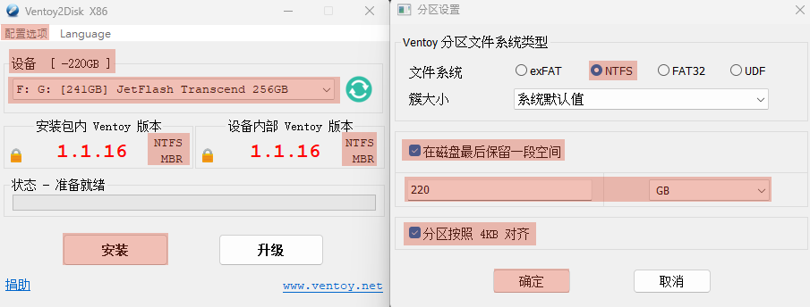
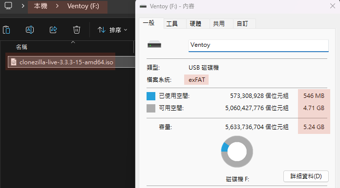
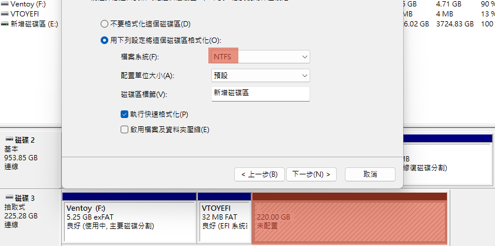
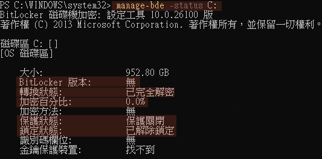
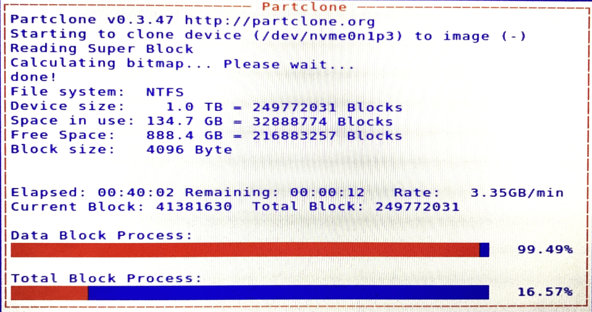
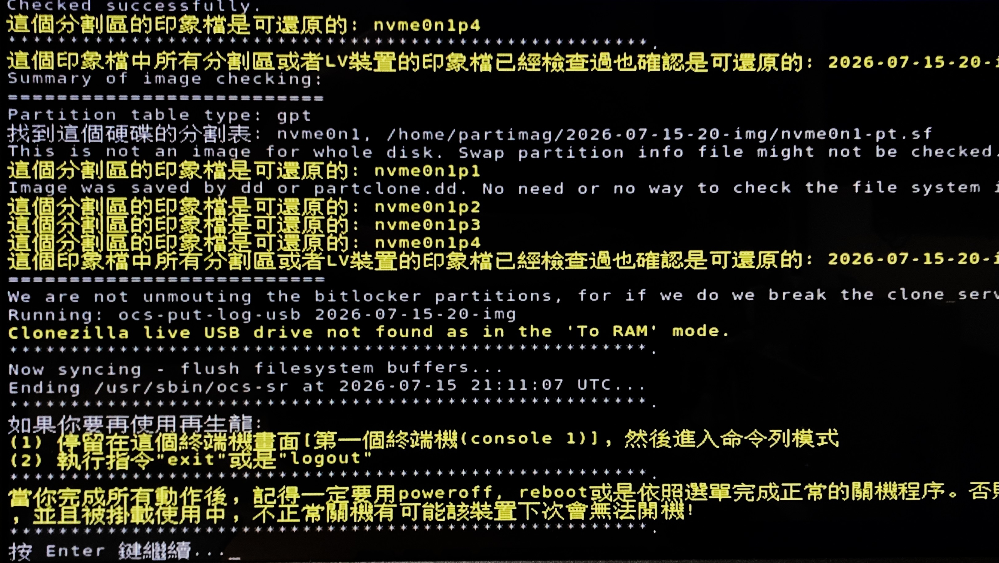

## *⭐ Offline Image Deployment ⭐*
> #### *離線映像還原 ( 災難還原 ) : 確保系統狀態與驅動程式 100% 回到某個特定時間點*

<br>

### *A.　⭐ 事前準備*
- #### *1. 大容量空白隨身碟*
  - #### *建立 Clonezilla 開機碟 ( 啟動隨身碟 ➔ To-RAM )*
  - #### *建立 儲存備份出來的映像檔資料夾 ( 兼存放映像檔 )*
  - #### *容量至少 225GB ( 視當前系統碟大小而定 )*
  - #### *無須手動格式化*

- #### *⭐ 2. Ventoy 分區軟體 ➔ 分區 [ exFAT 開機 ] + [ NTFS 儲存 ]*
  - #### *將 Clonezilla ISO 檔複製到隨身碟*

- #### *3. 鏡像前系統瘦身*
  ```
  # 清理系統元件 (WinSxS): 掃描並清除被取代的 Windows 元件 (此動作不可逆，清理完後無法解除安裝過往更新)
  dism /online /cleanup-image /startcomponentcleanup /resetbase
  
  # 瘦身腳本
  ./scripts/optimize_system.ps1
  ```

<br>

### *B.　操作手冊*
- #### *1. 製作啟動隨身碟 ( Rescue Media )*
  > ⚠️ **注意：此步驟會格式化隨身碟，請先備份隨身碟內資料**
  * [x] 1 官網下載 _**[Clonezilla 穩定發行版 ISO 映像檔](https://clonezilla.nchc.org.tw/clonezilla-live/download/)**_
  * [x] 2 插上隨身碟，開啟工具 _**[Ventoy2Disk.exe](https://www.ventoy.net/en/download.html)**_ 進行分區切割
  * [x] 3 將下載好的 ISO 檔，直接複製該空間 **`Ventoy (F)`**
  * [x] 4 上述都完成後，該支隨身碟即為 Clonezilla 啟動碟
  * [x] 5 在磁碟管理將 **`剩餘空間設定成 NFTS (G)`** 用來存放鏡像檔位置
  
  - #### *Example 1*
    
  - #### *Example 2*
    
  - #### *Example 3*
    

<br>

- #### *2. 創建鏡像 ( 備份系統碟 )*
  > 💡 準備動作：插上啟動隨身碟 + 重啟電腦 + 離線備份原則 ( 拔除網路線 )
  * [x] 1 先行解密系統碟： **`./scripts/disable_c_bit_locker.ps1`**
  * [x] 2 進入 Clonezilla 前，務必執行 **`manage-bde -status C:`**，確認狀態為 **`已解除保護（Fully Decrypted）`**
  * [x] 3 開機時按 F12（或 Del/F11 或`設定` `系統` `復原` `進階啟動` ）進入 Boot Menu，選擇由**隨身碟開機**
  * [x] 4 進入選單後選擇 **`Boot in normal mode`** ➔ **`Clonezilla live ( VGA 800x600 & To RAM )`** ➔ 語言選擇 **`正體中文`** ➔ **`不要修改鍵盤對應`**
  * [x] 5 選擇 **`device-image（使用映像檔）`** ➔ 選擇 **`local_dev（使用本機儲存裝置）`**
  * [x] 6 系統會要求選擇`備份檔存放位置`，此時選擇 **`隨身碟`**，並選定資料夾
  * [x] 7 模式選擇 **`Expert (參考底下選填參數)`** ➔ 選擇 **`partdisk`** ➔ 選擇 **`disk or part`**
  * [x] 8 輸入備份檔名 **`Win11_Clean_Backup (若無建立 則先用再生龍的命令列建立)`**，接著一路按 Enter 接受預設，最後輸入 **`y`** 確認，系統就會開始跑進度條備份
  * [x] 9 創建鏡像完成後，重新進入系統回歸正常使用，手動執行 **`manage-bde -on C:`**<br>**`重啟前（務必耐心等待狀態顯示已解鎖: manage-bde -status C:）`**，確保 TPM 安全綁定重新建立
  
  <br>
  
  ```
  # 退出再生龍 : Ctrl + Alt + Del
  # 遇到一致性問題 ( 重新啟動電腦 ) : chkdsk C: /f /r  ➔  restart-computer
  # 中斷進度 : Ctrl + C
  
  
  # -i : 檢查剛備份完的映像檔是否完整
  # -no-fsck : 略過不檢查分割曲一致性 ( 全部完成後再一次性驗證 )
  # -sfsck : 略過檢查與修正來源分割區的檔案系統
  # -sgoc : 不加密映像檔
  # -rescue : 不勾選 會導致進度慢到像停滯
  # 額外參數 : -c / -j2 / -edio
  # 選擇分割 : 4000(MB) 一個檔案
  # 加速模式選擇 : z0 ( 不壓縮 )
  ```
  
  <br>
  
  - #### *Example 4*
    
  - #### *Example 5*
    
  - #### *Example 6*
    

<br>

- #### *3. 還原鏡像 ( 災難發生 )*
  > 💡 準備動作：同樣用隨身碟開機引導 (選擇 To-RAM 選擇同時存放其中的映像檔)
  * [ ] 1 重複上述的步驟（創建鏡像）`3` 到 `6`，讓 Clonezilla 掛載 **`隨身碟`**
  * [ ] 2 進入模式時選 **`Beginner 初學模式`**，但改選 **`restoredisk（還原映像檔到本機硬碟 # 用容量大小識別 否則洗到資料碟 你會哭死）`**
  * [ ] 3 選擇之前備份的資料夾名稱（`Win11_Clean_Backup`）
  * [ ] 4 選擇 **C 槽硬碟** 作為目標目的地
  * [ ] 5 系統會跳出紅色警告字體，連續輸入兩次 **`y`** 確認（ **覆寫並清空 C 槽** ）
  * [ ] 6 進度條跑完後選擇重開機，拔掉隨身碟，系統就還原完成

  - #### *⭐ 重新啟用 BitLocker 並確保 TPM 已正確綁定*
    ```
    # 等待它完成，過程中不進行大量寫入動作
    Enable-BitLocker -MountPoint "C:" -EncryptionMethod XtsAes256 -UsedSpaceOnly -TpmProtector
    ```


<br><br>