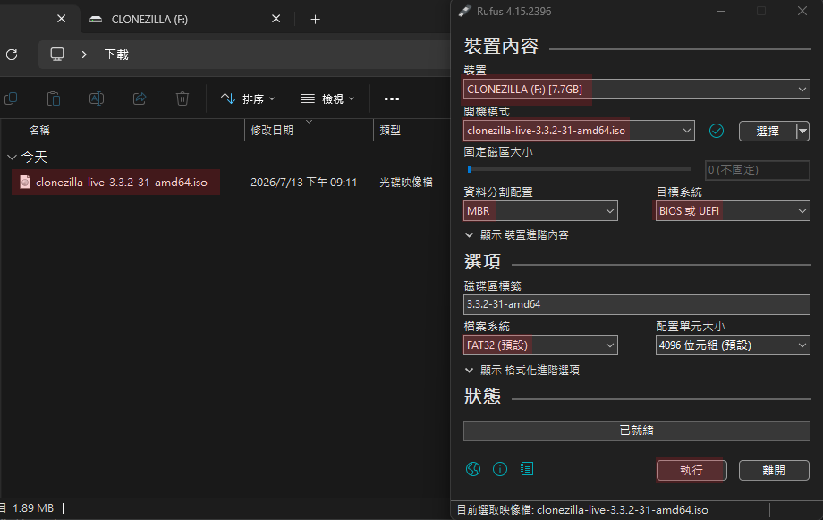
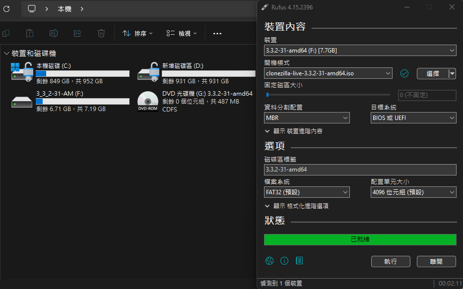

## *⭐ Offline Image Deployment ⭐*
> #### *離線映像還原 ( 災難還原 ) : 確保系統狀態與驅動程式 100% 回到某個特定時間點*

 

### *B.　⭐ 事前準備工具*
- #### *1. 空白隨身碟 [ A ]*
  - #### *用來做 Clonezilla 開機碟 ( 啟動隨身碟 )*
  - #### *容量至少 1GB*
  - #### *官網下載 Clonezilla 穩定發行版*

- #### *2. 大容量硬碟 [ B ]*
  - #### *用來儲存備份出來的映像檔資料夾*

- #### *3. Rufus 燒錄軟體*
  - #### *將 Clonezilla ISO 檔燒進隨身碟*

 

### *C.　操作手冊*
- #### *1. 製作啟動隨身碟 ( Rescue Media )*
  > ⚠️ **注意：此步驟會格式化隨身碟，請先備份隨身碟內資料**
  * [ ] 1 到官網下載 **[Clonezilla 穩定發行版](https://clonezilla.nchc.org.tw/clonezilla-live/download/)** 的 ISO 映像檔
  * [ ] 2 插上隨身碟 A，開啟工具 [Rufus 燒錄軟體](https://rufus.ie/zh_TW/)
  * [ ] 3 在 Rufus 中選擇下載好的 Clonezilla ISO 檔，點擊 `執行` 進行燒錄
  * [ ] 4 燒錄完成後，這支隨身碟即為 Clonezilla 啟動碟
  
  

 

- #### *2. 創建鏡像 ( 備份全系統 )*
  > 💡 準備動作：插上「啟動隨身碟 A」與「行動硬碟 B」，重啟電腦
  * [ ] 1 開機時按 F12 ( 或 Del/F11 ) 進入 Boot Menu，選擇由**隨身碟 A 開機**
  * [ ] 2 進入選單後選擇 **`Clonezilla live`** -> 語言選擇 **`正體中文`** -> **`不要修改鍵盤對應`**
  * [ ] 3 選擇 **`device-image ( 使用映像檔 )`** -> 選擇 **`local_dev ( 使用本機儲存裝置 )`**
  * [ ] 4 系統會要求選擇`要把備份檔存在哪裡`，此時選擇 **行動硬碟 B**，並選定資料夾
  * [ ] 5 模式選擇 **`Beginner 初學模式`** -> 選擇 **`savedisk ( 儲存整顆硬碟為映像檔 )`**
  * [ ] 6 輸入備份檔名 `Win11_Clean_Backup`，接著一路按 Enter 接受預設，最後輸入 **`y`** 確認，系統就會開始跑進度條備份

 

- #### *3. 還原鏡像 ( 災難發生 )*
  > 💡 準備動作：同樣用隨身碟 A 開機引導，並插上存有備份的行動硬碟 B
  * [ ] 1 重複上述的步驟 ( 創建鏡像 ) `1` 到 `4`，讓 Clonezilla 掛載 **行動硬碟 B**
  * [ ] 2 進入模式時一樣選 **`Beginner 初學模式`**，但這次改選 **`restoredisk ( 還原映像檔到本機硬碟 )`**
  * [ ] 3 選擇之前備份的資料夾名稱（如 `Win11_Clean_Backup`）
  * [ ] 4 選擇 **電腦內建 SSD (通常是 C 槽所在的硬碟)** 作為目標目的地
  * [ ] 5 系統會跳出紅色警告字體，連續輸入兩次 **`y`** 確認（這會覆寫並清空 C 槽）
  * [ ] 6 進度條跑完後選擇重開機，拔掉隨身碟，系統就還原完成了！

  